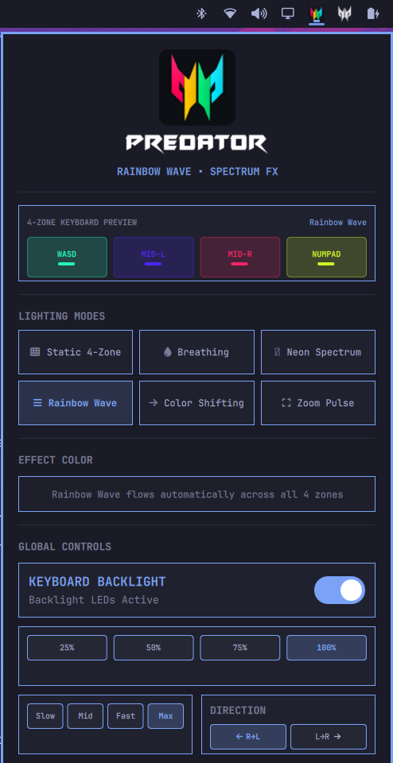

<p align="center">
  
</p>

# Omarchy Predator RGB Keyboard Plugin (`predator-rgb`)

A native, first-class **Omarchy (Quickshell)** bar widget and interactive 4-Zone RGB control center for **Acer Predator Helios 300 (PH315-52)** and related Acer Predator gaming laptops.

Created with ❤️ by **Aniket B. ([@Aniket1995](https://github.com/Aniket1995))**.



---

## ✨ Features

- **Status Bar 4-Zone Emblem Widget:** Custom 4-zone spectrum Predator emblem on the top bar with active backlight status indicator line and dynamic sleep dimming.
  - **Left-Click:** Opens the full RGB Control Center popup.
  - **Right-Click:** Instantly toggles keyboard backlight ON/OFF without opening the panel.
- **Predator Hero Header:** Sleek 4-zone hardware badge, razor-sharp high-resolution Predator wordmark, and live status subtitle displaying the active profile or hardware sleep.
- **Interactive 4-Zone Keyboard Visualizer:** Real-time mini graphic previewing WASD, Mid-Left, Mid-Right, and Numpad zone colors and smooth wave simulations. Click any zone to immediately style it.
- **All 6 Supported Hardware Modes:**
  1. **Static 4-Zone:** Independent custom RGB color control per zone or synchronized across all zones.
  2. **Breathing:** Rhythmic pulsating glow with custom RGB color.
  3. **Neon Spectrum:** Continuous rainbow spectrum color-cycling.
  4. **Rainbow Wave:** Dynamic cascading wave across all 4 zones.
  5. **Color Shifting:** Cascading wave with custom RGB color.
  6. **Zoom Pulse:** Radial explosion pulse from center.
- **Global Hardware Controls:** Master backlight toggle, brightness steppers (25%-100%), animation speed (1-9), and direction switch (`◀ R→L` / `L→R ▶`).
- **Quick Presets:** Instant one-click profiles (*Predator Cyan*, *Cyber Neon*, *Rainbow Wave*, *Turbo Red*, *Stealth Off*).
- **100% Sudoless:** Communicates directly with `/dev/acer-gkbbl-0` and `/dev/acer-gkbbl-static-0` with zero password prompts.

---

## 🚀 Installation

Install directly with Omarchy's plugin manager:

```bash
omarchy plugin add https://github.com/Aniket1995/omarchy-predator-rgb.git --enable
```

To update in the future:
```bash
omarchy plugin update predator-rgb
```

---

## 🗑️ Removal

To disable and remove the plugin from Omarchy:

```bash
omarchy plugin remove predator-rgb
```

---

## 📋 Prerequisites

This plugin communicates with `/dev/acer-gkbbl-0` and `/dev/acer-gkbbl-static-0`. Ensure the `facer` DKMS module or an ACPI driver providing these device nodes is active on your Predator laptop.

---

## 🎖️ Acknowledgements & Citations

- **Kernel Module & Character Device Driver:**  
  Massive thanks and full credit to **Jafar Akhondali** ([@JafarAkhondali](https://github.com/JafarAkhondali)) for developing the open-source [`acer-predator-turbo-and-rgb-keyboard-linux-module`](https://github.com/JafarAkhondali/acer-predator-turbo-and-rgb-keyboard-linux-module) (`facer`) driver and exposing the `/dev/acer-gkbbl*` character devices for Linux.
- **Omarchy Shell Plugin:**  
  Conceived, designed, and developed by **Aniket B.** for the [Omarchy](https://github.com/basecamp/omarchy) ecosystem.

---

## 📄 License

MIT License © 2026 Aniket B.
